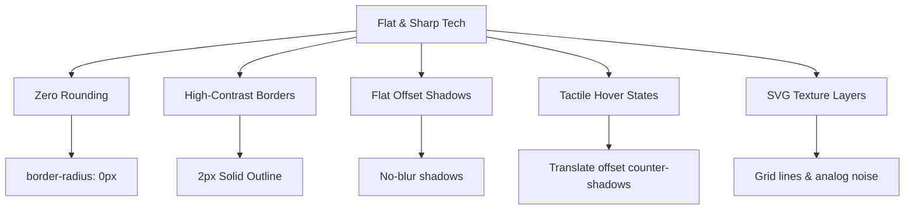

# 🎨 Design Style Guide: "Flat & Sharp Tech"
### Neobrutalism Meets Rosé Pine

This document outlines the core principles, color token systems, Tailwind configuration, component recipes, and extension guidelines for the **Flat & Sharp Tech** design style used across the **BulkReach** platform.

---

## 🏛️ Core Design Philosophy

The Flat & Sharp Tech aesthetic is a modern synthesis of **Neobrutalism** and the warm, curated colors of the **Rosé Pine** palette. It rejects typical modern design trends of soft, blurred shadows, rounded cards, and safe pastel gradients, instead prioritizing high contrast, tactile feedback, and structural rigidity.



### Key Principles

1. **Zero Rounded Corners (`rounded-none`)**: Every component (buttons, inputs, cards, dialogs, badges, and scrollbar thumbs) must have completely sharp corners.
2. **High-Contrast Borders (`border-2 border-text`)**: Components are bounded by solid, thick outlines. They separate surfaces explicitly rather than relying on shadow differentiation.
3. **Flat, Blurless Shadows (`box-shadow: Xpx Xpx 0px 0px COLOR`)**: Traditional soft CSS box shadows are forbidden. Instead, use offset, solid-color shadows that mimic printed cutouts or vintage computer interfaces.
4. **Tactile Micro-Interactions**: Hovering over interactive elements slides them offset (`transform: translate(-3px, -3px)`) and increases the shadow distance correspondingly. Clicking (`:active`) presses them down to `(0, 0)` with no shadow, mimicking physical buttons.
5. **Digital Textures**: Use repeating background patterns (like grid lines and micro analog noise) to give the application a retro, high-end feel.

---

## 🎨 Color Palette & Tokens

The theme uses custom CSS variables mapped to Tailwind colors. It dynamically shifts between Light and Dark mode using the `.dark` class wrapper.

### Theme Variables (`src/index.css`)

| Color Token | Light Theme Value (Slate) | Dark Theme Value (Slate) | Role / Usage |
| :--- | :--- | :--- | :--- |
| `--color-base` | `#f8fafc` (Slate 50) | `#0f172a` (Slate 900) | Application layout background |
| `--color-surface` | `#ffffff` (White) | `#1e293b` (Slate 800) | Card, modal, and input background |
| `--color-overlay` | `#f1f5f9` (Slate 100) | `#334155` (Slate 700) | Hovered/active card surfaces, dropdowns |
| `--color-muted` | `#64748b` (Slate 500) | `#94a3b8` (Slate 400) | Secondary body text, disabled states |
| `--color-subtle` | `#475569` (Slate 600) | `#cbd5e1` (Slate 300) | Auxiliary borders, secondary icons |
| `--color-text` | `#0f172a` (Slate 900) | `#f8fafc` (Slate 50) | Primary typography, high-contrast borders |

### Rosé Pine Accents

These primary colors are inspired by the popular Rosé Pine syntax theme and are used for indicators, states, alerts, and brand components:

| Accents | Hex Code (Light / Dark) | Accent Role | Status State |
| :--- | :--- | :--- | :--- |
| **`love`** | `#ef4444` | Red | Danger / FAILED / Action Cancelled |
| **`gold`** | `#f59e0b` | Gold / Amber | Warning / QUEUED / Inactive |
| **`rose`** | `#db2777` / `#f472b6` | Rose / Pink | Special highlights / PAUSED |
| **`pine`** | `#2563eb` / `#3b82f6` | Royal Blue | Primary actions / Selected / Focus state |
| **`foam`** | `#10b981` / `#34d399` | Emerald / Mint | Success / SENT / Verified |
| **`iris`** | `#6366f1` / `#818cf8` | Indigo / Purple | Running processes / Active glow highlights |

---

## 🛠️ Tailwind Extension Blueprint

The `tailwind.config.ts` extends colors, shadows, and animations to support this layout:

```typescript
colors: {
  brand: {
    50: "#eef2ff",
    // ...
    500: "#6366f1", // Iris (Indigo)
    600: "#4f46e5", // Deep Iris
    // ...
  },
  surface: {
    DEFAULT: "var(--color-surface)",
    50: "var(--color-overlay)",
    100: "var(--color-overlay)",
    200: "var(--color-base)",
  },
  // Rose Pine color bindings
  "rose-base": "var(--color-base)",
  "rose-surface": "var(--color-surface)",
  "rose-overlay": "var(--color-overlay)",
  "rose-muted": "var(--color-muted)",
  "rose-subtle": "var(--color-subtle)",
  "rose-text": "var(--color-text)",
  "rose-love": "var(--color-love)",
  "rose-gold": "var(--color-gold)",
  "rose-rose": "var(--color-rose)",
  "rose-pine": "var(--color-pine)",
  "rose-foam": "var(--color-foam)",
  "rose-iris": "var(--color-iris)",
  "rose-hl-low": "var(--color-hl-low)",
  "rose-hl-med": "var(--color-hl-med)",
  "rose-hl-high": "var(--color-hl-high)",
},
boxShadow: {
  "rose-sm": "none",
  "rose-md": "none",
  "rose-lg": "none",
  "rose-glow": "none", // Avoid soft glows
},
backgroundImage: {
  "gradient-brand": "linear-gradient(135deg, var(--color-pine) 0%, var(--color-iris) 100%)",
}
```

---

## 📦 Component Blueprint Recipes

Below are the exact Tailwind class combinations to maintain stylistic consistency when building or editing components.

### 1. Cards and Containers

```html
<!-- Interactive Card (translates on hover) -->
<div class="card card-interactive">
  <h3 class="text-lg font-bold">Interactive Card</h3>
  <p class="text-sm text-rose-muted">Hover me to see the offset transform.</p>
</div>

<!-- Non-Interactive Glass Panel -->
<div class="glass p-6">
  <h3 class="text-lg font-bold">Flat Static Panel</h3>
</div>
```

**Underlying CSS Rules:**
- `.glass`: `background: var(--color-surface); border: 2px solid var(--color-text); border-radius: 0px; box-shadow: 4px 4px 0px 0px var(--color-hl-high);`
- `.card-interactive:hover`: `border-color: var(--color-pine); transform: translate(-3px, -3px); box-shadow: 7px 7px 0px 0px var(--color-text);`
- `.card-interactive:active`: `transform: translate(0, 0); box-shadow: 4px 4px 0px 0px var(--color-hl-high);`

### 2. Buttons

Buttons must use sharp corners and pop outwards on hover:

```html
<!-- Primary (Pine Accent) -->
<button class="btn-primary">
  Send Campaign
</button>

<!-- Secondary (Base/Surface Accent) -->
<button class="btn-secondary">
  Cancel
</button>

<!-- Danger (Love Accent) -->
<button class="btn-danger">
  Delete Draft
</button>
```

**Key Tailwind Equivalents:**
- `btn-primary`: `inline-flex items-center justify-center gap-2 px-5 py-2.5 rounded-none font-bold text-sm text-white border-2 border-rose-text bg-rose-pine transition-all active:scale-[0.98] hover:-translate-x-[3px] hover:-translate-y-[3px] hover:shadow-[3px_3px_0px_0px_var(--color-text)] active:translate-x-0 active:translate-y-0 active:shadow-none`

### 3. Form Inputs

Inputs use a high-contrast border that switches to an active accent offset outline when focused:

```html
<div>
  <label class="label">Campaign Name</label>
  <input type="text" class="input" placeholder="e.g. Q3 Software Engineer Outreach" />
</div>
```

**Underlying CSS Rules:**
- `.input`: `width: 100%; padding: 10px 16px; border-radius: 0px; border: 2px solid var(--color-hl-high); background-color: var(--color-surface);`
- `.input:focus`: `outline: none; border-color: var(--color-text); box-shadow: 3px 3px 0px 0px var(--color-iris);`

### 4. Status Badges

Badges have black outlines with light background colors based on their active state:

```html
<span class="badge-draft">Draft</span>
<span class="badge-running">Running</span>
<span class="badge-done">Done</span>
<span class="badge-failed">Failed</span>
```

---

## 🏁 Textured Utilities

To break up flat areas and make the screen feel tactile:

### The Dot Grid Background (`grid-bg`)
Used on dashboards and main layout backs:
```css
.grid-bg {
  background-image:
    linear-gradient(to right, var(--color-hl-med) 1px, transparent 1px),
    linear-gradient(to bottom, var(--color-hl-med) 1px, transparent 1px);
  background-size: 32px 32px;
}
```

### SVG Analog Noise Layer (`noise-bg`)
An absolute overlay that provides a slight, premium paper texture:
```css
.noise-bg {
  background-image: url("data:image/svg+xml,%3Csvg viewBox='0 0 256 256' xmlns='http://www.w3.org/2000/svg'%3E%3Cfilter id='noise'%3E%3CfeTurbulence type='fractalNoise' baseFrequency='0.9' numOctaves='4' stitchTiles='stitch'/%3E%3C/filter%3E%3Crect width='100%25' height='100%25' filter='url(%23noise)' opacity='0.015'/%3E%3C/svg%3E");
}
```

---

## 📧 Email Template Design Rules

When creating templates or rendering campaign emails dynamically, standard CSS variables aren't supported. You must translate the Neobrutalist aesthetic into raw HTML table wrappers with inline styles:

1. **Header Banner**: Must use both `background-color` and `background-image` with a `135deg` linear gradient.
   * *Example:* `style="background-color:#2563eb; background-image:linear-gradient(135deg, #2563eb 0%, #7c3aed 100%);"`
2. **CTA Buttons**:
   * Must use a sharp corner border: `border: 2px solid #0f172a;`
   * Must use a flat shadow offset: `box-shadow: 3px 3px 0px 0px #0f172a;`
3. **Accent Highlight Cards**: Use a high contrast light-gray container table:
   * `style="background:#f1f5f9; border:2px solid #0f172a; border-radius:0px;"`
4. **Typography**: Always use clean sans-serif families: `font-family: Arial, Helvetica, sans-serif;`

---

## 🧭 Developer Guidelines for Extensions

When creating a new component or view, follow this checklist to ensure compliance:

* [ ] Did you add any rounded corners (`rounded-...`)? If so, remove them or change to `rounded-none`.
* [ ] Are there standard soft shadows (`shadow-sm`, `shadow-md`, `shadow-lg`)? Replace them with flat offsets or no shadow.
* [ ] Do your buttons and interactive elements have translate transforms on hover? Ensure they translate negatively (`-translate-x-[3px] -translate-y-[3px]`) and slide back to `translate-0` on active click.
* [ ] Are form labels uppercase, bold, and tracked wider? Use `.label`.
* [ ] Are scrollbars customized with sharp thumbs and boundaries? Ensure the `::-webkit-scrollbar` defaults from `index.css` are inherited.
